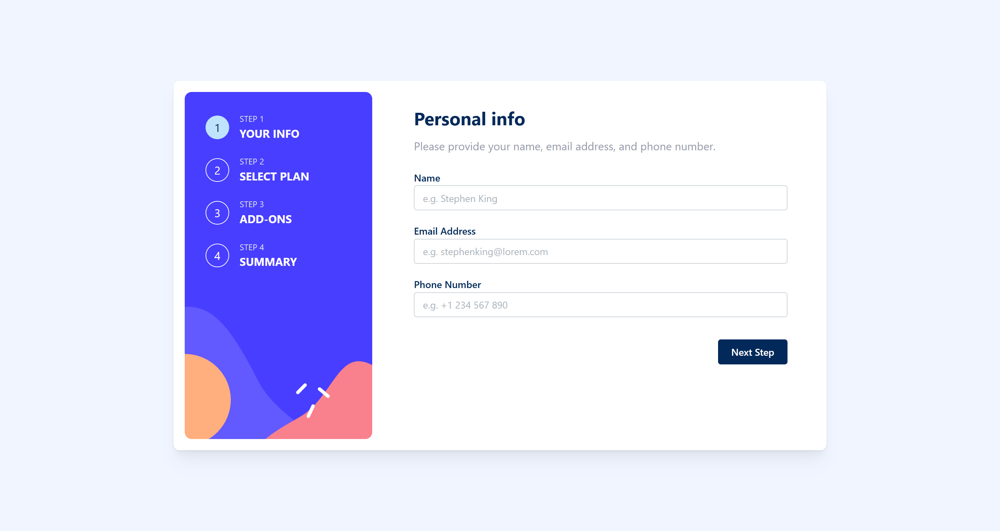

# Frontend Mentor - Multi-step form solution

This is a solution to the [Multi-step form challenge on Frontend Mentor](https://www.frontendmentor.io/challenges/multistep-form-YVAnSdqQBJ). Frontend Mentor challenges help you improve your coding skills by building realistic projects. 

## Table of contents

- [Overview](#overview)
  - [The challenge](#the-challenge)
  - [Screenshot](#screenshot)
  - [Links](#links)
- [My process](#my-process)
  - [Built with](#built-with)
  - [What I learned](#what-i-learned)
  - [Continued development](#continued-development)
- [Author](#author)

## Overview

### The challenge

Users should be able to:

- Complete each step of the sequence
- Go back to a previous step to update their selections
- See a summary of their selections on the final step and confirm their order
- View the optimal layout for the interface depending on their device's screen size
- See hover and focus states for all interactive elements on the page
- Receive form validation messages if:
  - A field has been missed
  - The email address is not formatted correctly
  - A step is submitted, but no selection has been made

### Screenshot

### Links

- Solution URL: [GitHub](https://github.com/gellend/frontend-mentor-challenges/tree/main/multi-step-form)
- Live Site URL: [Demo](https://multi-step-form-gellend.vercel.app/form/your-info)

## My process

### Built with

- [Next.js](https://nextjs.org/) - React framework
- [React](https://reactjs.org/) - JS library
- [Mantine](https://mantine.dev/) - React component library
- [TypeScript](https://www.typescriptlang.org/) - JavaScript superset
- [Zustand](https://zustand-demo.pmnd.rs/) - State management library
- CSS Modules - For component-level styling
- Mobile-first workflow

### What I learned

Some key learnings from this project include:
- Setting up a Next.js project with Mantine, including `MantineProvider` and `ColorSchemeScript` to handle potential hydration issues.
- Implementing a multi-step form with dynamic routing (`[stepId]`) in Next.js App Router.
- Managing global form state across multiple components using Zustand, including creating slices for different parts of the form data and actions to update the state.
- Using `@mantine/form` for form handling, validation, and submission.
- Structuring a React application with components, hooks, types, and state management.
- Debugging common React issues such as "Maximum update depth exceeded" often related to state updates and effect dependencies.
- Styling components using a combination of Mantine's props, theme overrides, and CSS Modules.

### Continued development

Areas for future focus could include:
- Advanced responsive design techniques with Mantine.
- More in-depth form validation and error handling.
- Writing automated tests for components and form logic.
- Optimizing performance for larger applications.

## Author

- Website - [gellend.github.io](https://gellend.github.io/)
- Frontend Mentor - [@gellend](https://www.frontendmentor.io/profile/gellend)