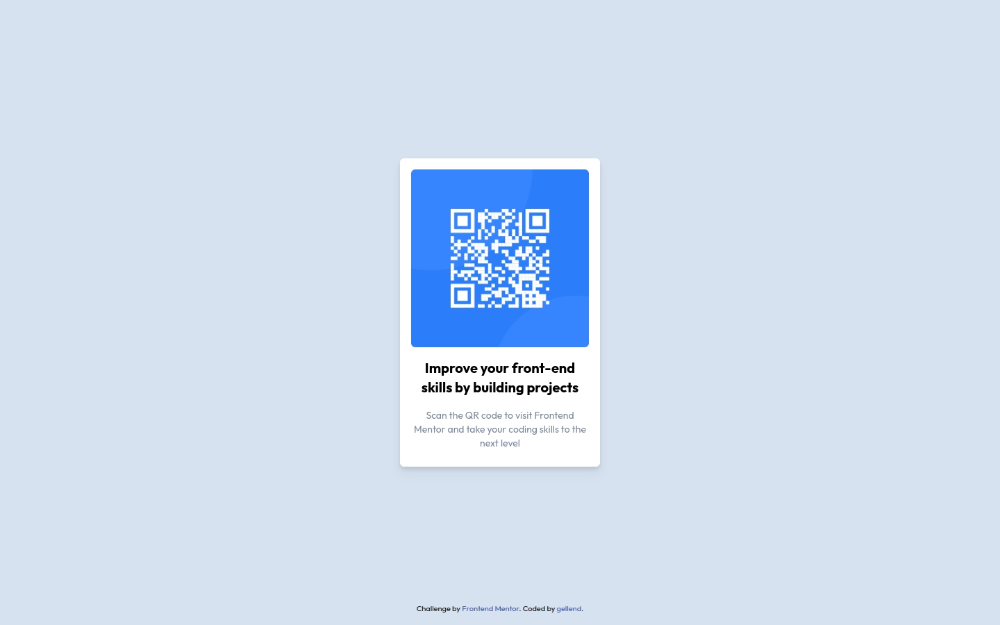
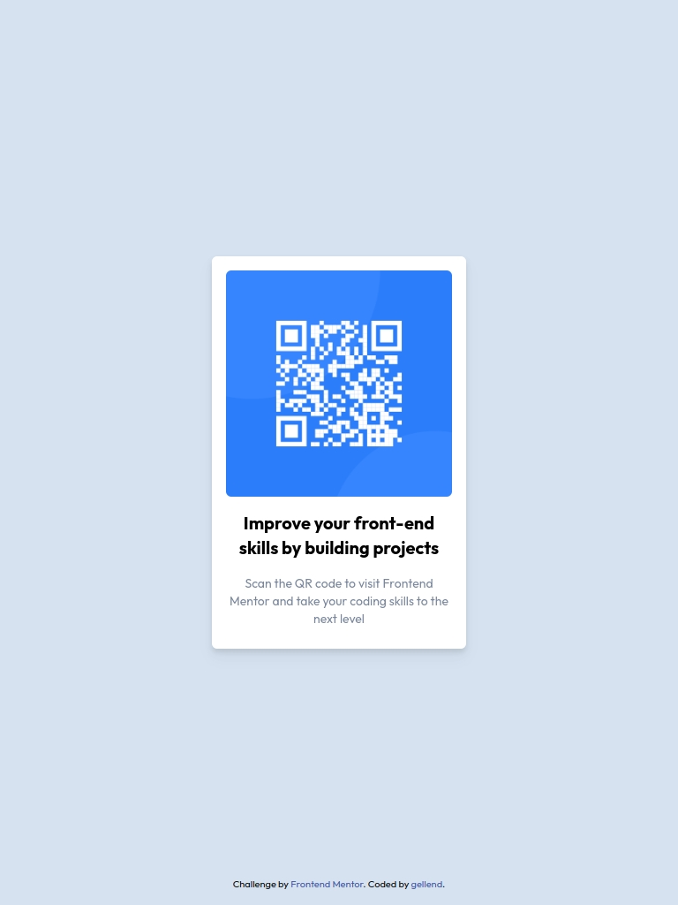

# Frontend Mentor - QR code component solution

This is a solution to the [QR code component challenge on Frontend Mentor](https://www.frontendmentor.io/challenges/qr-code-component-iux_sIO_H). Frontend Mentor challenges help you improve your coding skills by building realistic projects.

## Table of contents

- [Overview](#overview)
  - [Screenshot](#screenshot)
  - [Links](#links)
- [My process](#my-process)
  - [Built with](#built-with)
- [Author](#author)

## Overview

### Screenshot

On Desktop

---

On Tablet

---

On Phone

### Links

- Solution URL: [GitHub](https://github.com/gellend/frontend-mentor-challenges/tree/main/qr-code-component)
- Live Site URL: [Demo](https://gellend.github.io/frontend-mentor-challenges/qr-code-component/)

## My process

### Built with

- Mobile-first workflow
- [TailwindCSS](https://tailwindcss.com) - CSS framework

## Author

- Frontend Mentor - [@gellend](https://www.frontendmentor.io/profile/gellend)
