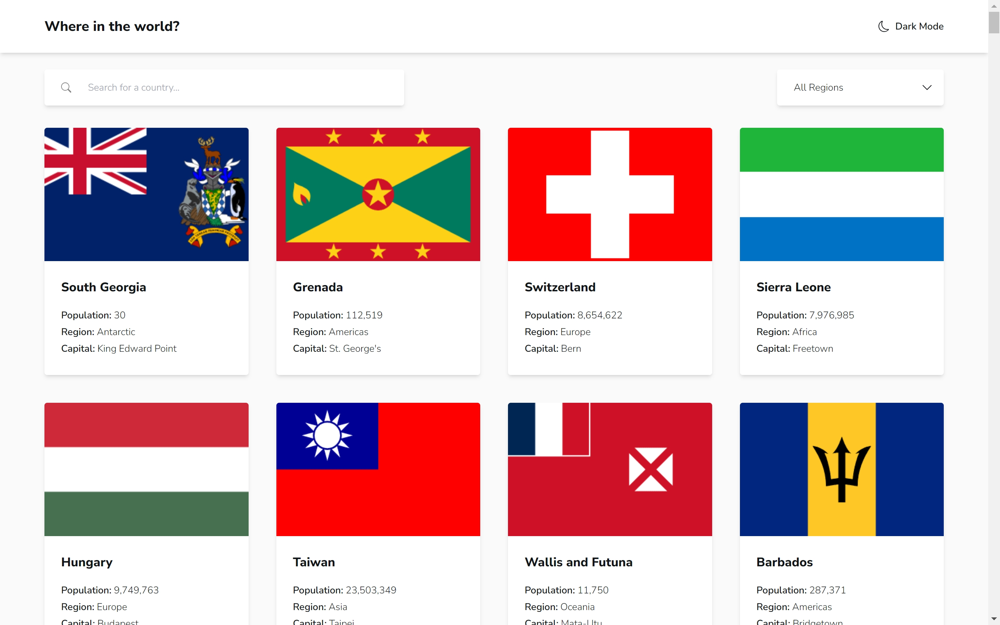
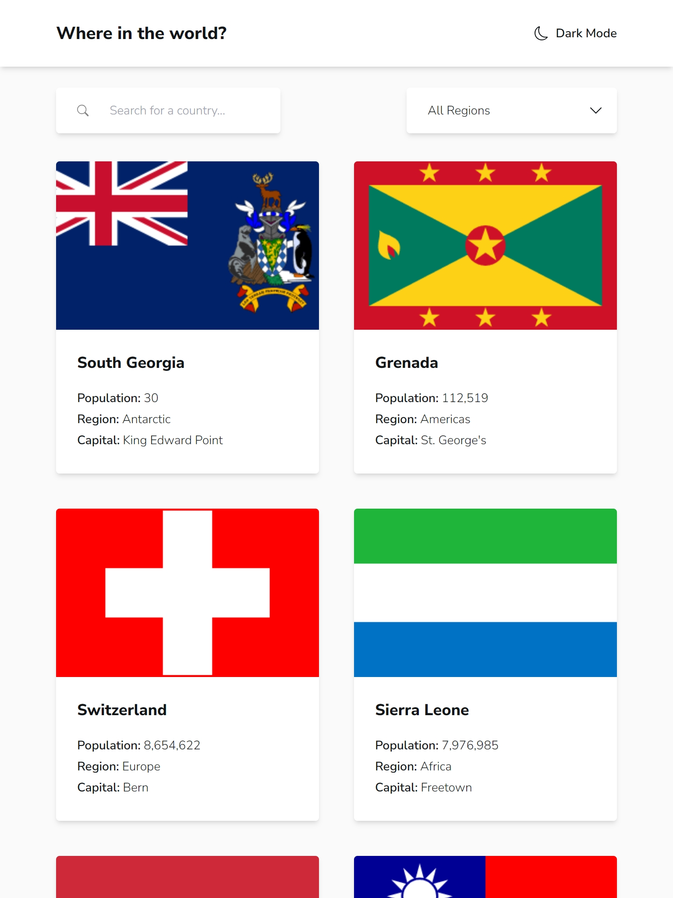

# Frontend Mentor - REST Countries API with color theme switcher solution

This is a solution to the [REST Countries API with color theme switcher](https://www.frontendmentor.io/challenges/rest-countries-api-with-color-theme-switcher-5cacc469fec04111f7b848ca).

## Table of contents

- [Overview](#overview)
    - [Screenshot](#screenshot)
    - [Links](#links)
- [My process](#my-process)
    - [Built with](#built-with)
- [Author](#author)

## Overview

### Screenshot

On Desktop

---

On Tablet

### Links

- Solution URL: [GitHub](https://github.com/gellend/frontend-mentor-challenges/tree/main/rest-countries-app)
- Live Site URL: [Demo](https://gellend.github.io/frontend-mentor-challenges/rest-countries-app/)

## My process

### Built with

- Mobile-first workflow
- [AlpineJS](https://alpinejs.dev/) - lightweight JavaScript framework
- [TailwindCSS](https://tailwindcss.com) - CSS framework

## Author

- Frontend Mentor - [@gellend](https://www.frontendmentor.io/profile/gellend)