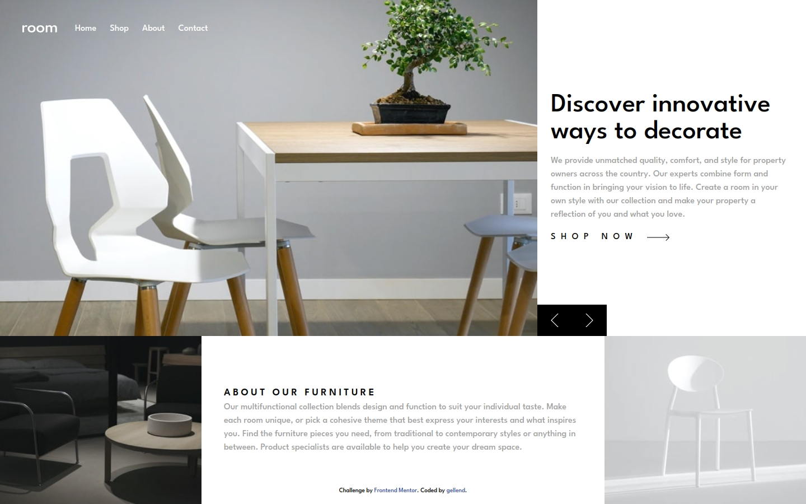
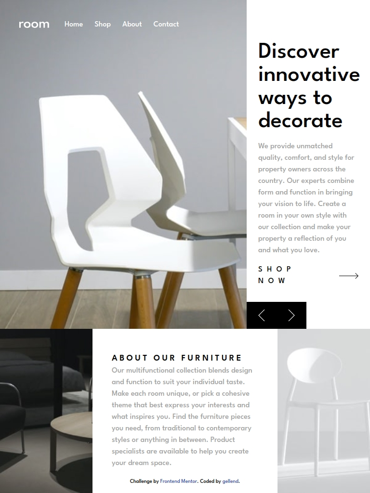
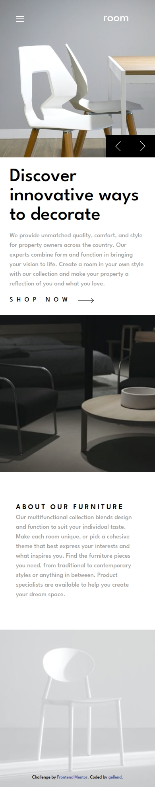

# Frontend Mentor - Room homepage solution

This is a solution to the [Room homepage challenge on Frontend Mentor](https://www.frontendmentor.io/challenges/room-homepage-BtdBY_ENq). Frontend Mentor challenges help you improve your coding skills by building realistic projects.

## Table of contents

- [Overview](#overview)
  - [The challenge](#the-challenge)
  - [Screenshot](#screenshot)
  - [Links](#links)
- [My process](#my-process)
  - [Built with](#built-with)
- [Author](#author)

## Overview

### The challenge

Users should be able to:

- View the optimal layout for the site depending on their device's screen size
- See hover states for all interactive elements on the page
- Navigate the slider using either their mouse/trackpad or keyboard

### Screenshot

On Desktop

---

On Tablet

---

On Phone

### Links

- Solution URL: [GitHub](https://github.com/gellend/frontend-mentor-challenges/tree/main/room-homepage)
- Live Site URL: [Demo](https://gellend.github.io/frontend-mentor-challenges/room-homepage/)

## My process

### Built with

- Flexbox
- CSS Grid
- Mobile-first workflow
- [TailwindCSS](https://tailwindcss.com) - CSS framework

## Author

- Frontend Mentor - [@gellend](https://www.frontendmentor.io/profile/gellend)
