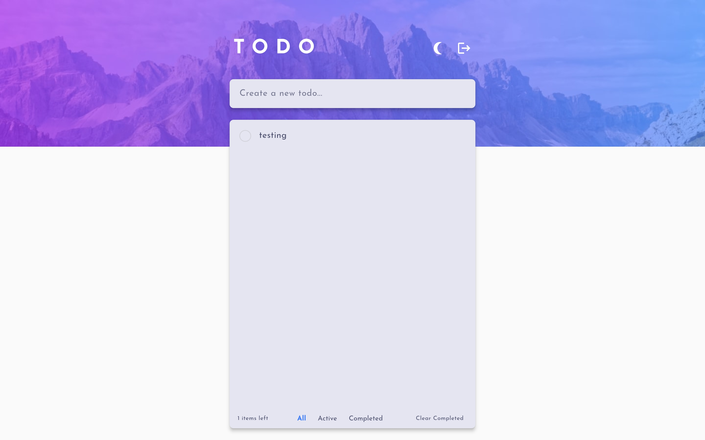

# Frontend Mentor - Todo app solution

This is a solution to the [Todo app challenge on Frontend Mentor](https://www.frontendmentor.io/challenges/todo-app-Su1_KokOW). Frontend Mentor challenges help you improve your coding skills by building realistic projects. 

## Table of contents

- [Overview](#overview)
  - [The challenge](#the-challenge)
  - [Screenshot](#screenshot)
  - [Links](#links)
- [My process](#my-process)
  - [Built with](#built-with)
  - [What I learned](#what-i-learned)
  - [Useful resources](#useful-resources)
- [Author](#author)

## Overview

### The challenge

Users should be able to:

- View the optimal layout for the app depending on their device's screen size
- See hover states for all interactive elements on the page
- Add new todos to the list
- Mark todos as complete
- Delete todos from the list
- Filter by all/active/complete todos
- Clear all completed todos
- Toggle light and dark mode
- **Bonus**: Drag and drop to reorder items on the list

### Screenshot

### Links

- Solution URL: [GitHub](https://github.com/gellend/frontend-mentor-challenges/tree/main/todo_app)
- Live Site URL: [Demo](https://todo-app-gellend.web.app/)

## My process

### Built with

- Flutter
- Dart
- Firebase
  - Firebase Authentication
  - Cloud Firestore
- Provider (for state management)
- Mobile-first workflow

### What I learned

- Setting up a Flutter project.
- Integrating Firebase for backend services.
- Implementing theme toggling with Provider.
- Building responsive UI elements.

### Useful resources

- [Flutter Documentation](https://flutter.dev/docs) - This is the official Flutter documentation, an invaluable resource.
- [Firebase Documentation](https://firebase.google.com/docs) - For all things Firebase.
- [Provider Package](https://pub.dev/packages/provider) - Useful for state management.

## Author

- Website - [Gellen](https://gellend.github.io/)
- Frontend Mentor - [@gellend](https://www.frontendmentor.io/profile/gellend)
- GitHub - [@gellend](https://github.com/gellend/)